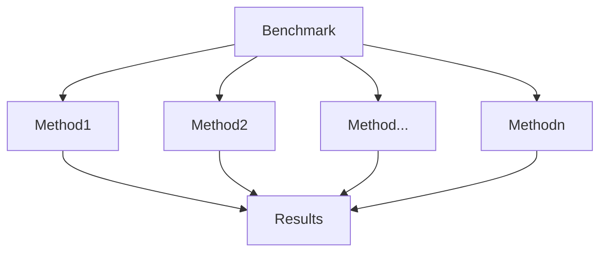
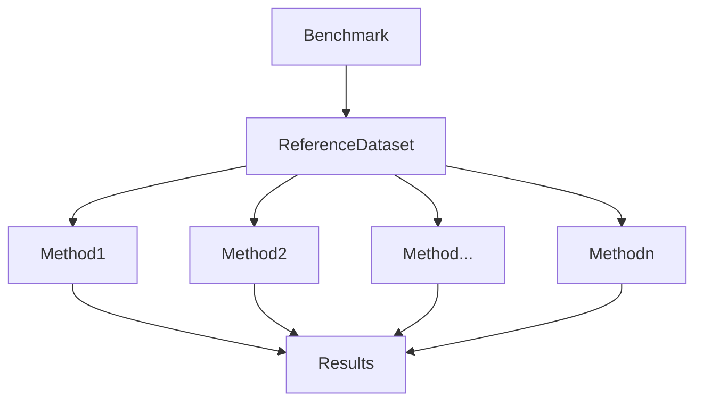
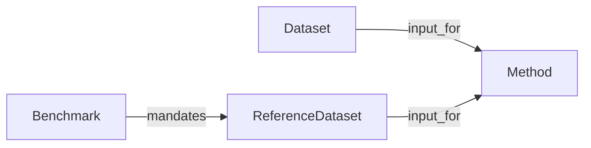
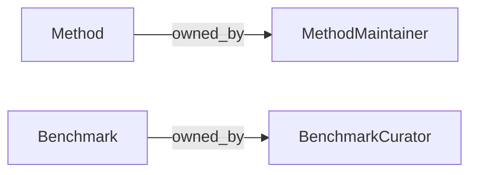
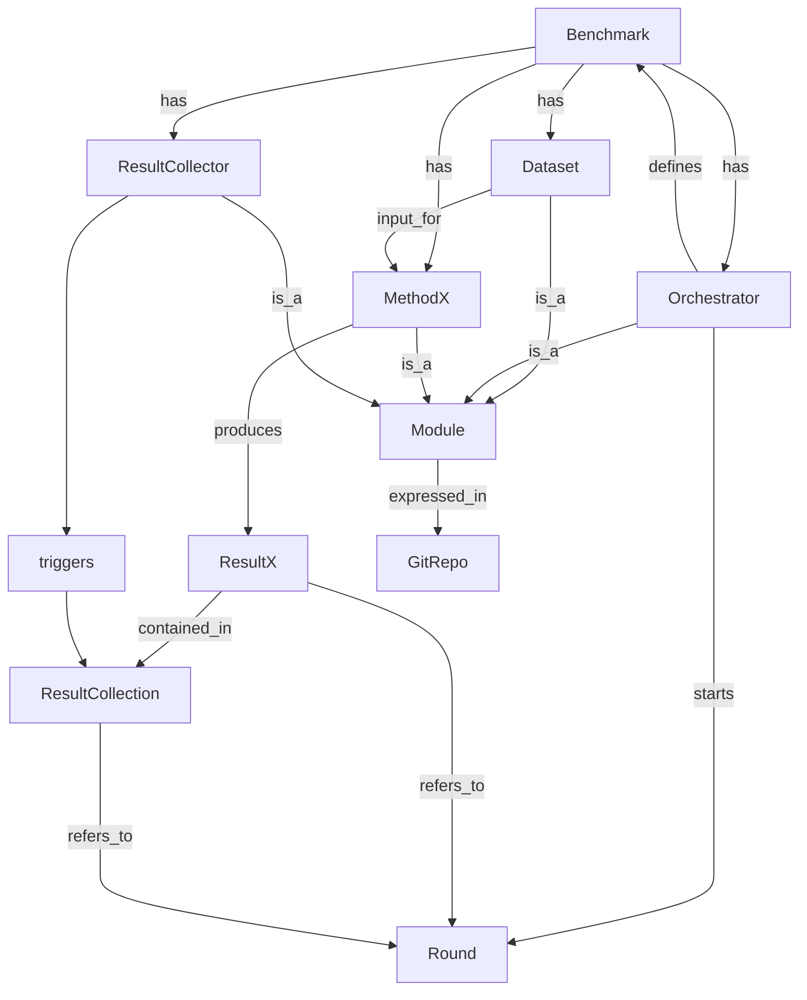
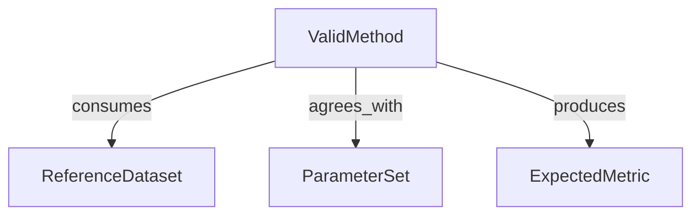
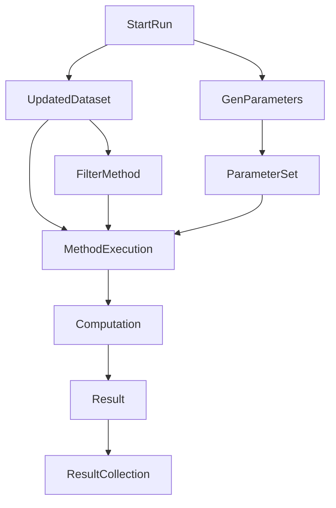

# Improving the Omnibenchmark Specification

The following are a few thoughts and explorations towards improving the current Omnibenchmark Ontology (and its matching execution specification).

Again, I'm trying to ignore a lot of specific details, and explore design concepts that might come handy for further integration in the final system.

## Design Goals

The main goals are:

- **Clarity**: Model the core concepts that are needed to declare, manipulate and query Omnibenchmark entities. 
- **Pragmatism**: We should start backwards: make sure we make easy to find answers for the important questions. In practice, this means answering the queries of the dashboard and finding good ways to express metrics about the method runs.
- **Performance**: Avoid expensive SPARQL queries

## Starting Point

I'm starting work on top of what's already captured on the [omnibenchmark_ontology repo](https://github.com/omnibenchmark/omnibenchmark_ontology/tree/main)

## Tools

- [Protege](https://protege.stanford.edu/) (with HermiT reasoner)
- python3 (>=3.10)
- jupyter-lab

## Entity Declaration

I'm going to break out entities into *conceptual* and *operative*. *Conceptual entities* will be the high-level classes we want to reason about. *Operative entities* are classes that we need to operate with to achieve our purposes.

### Conceptual Classes

* A **Benchmark** is the top-level entity that compares **Methods** among each other. Different benchmarks use different namespaces, and in principle comparisons are only meaningful inside a single Benchmark namespace.
* The purpose of a given benchmark has a well-defined biological and methodological statement. In essence, we want to compare (and possibly rank) different **Methods** against each other.

* A **Method** is the Thing that we will ultimately compare. A **method** is a collection of programs that transform Input Data (from given **Datasets**) and produces **Results**.

* A **Method** can use any **Dataset** for development and training, but 
* A **Benchmark** mandates that all qualifying **Methods** have to use the given **ReferenceDataset** as the starting point for the official run.

* **Methods** choose to participate in a **Benchmark** [^isopen]. Participating in the benchmark means:
  * Meeting the I/O requirements (validation). Input means using the **ReferenceDataset**, Output means producing the expected **Metrics**.
  * Ensuring that the method is run in a given time window
  * Being represented in the Result Collection.
* A **ResultCollection** is a set of **Results** produced by different **Methods**. The ResultCollection can vary with time, depending on what methods were available and qualified for a given **Round**.

[^isopen]: Refer to note [^openworld] about definition of Open World.

Some peopleware:

* **Methods** are maintained by *People* (**Method Maintainers**).
* **Benchmarks** are maintained by *Other People*, a.k.a. the Omnibenchmark Team (**Benchmark Curators**).

This distinction is important because it can clearly delimit responsibilities.

### Operative Classes

* A **Module** is a generic bundle of data and code. A particular **Benchmark**, conceptually, is just a collection of modules, of a few predefined classes. The cardinality of benchmark modules can vary: we expect to have one and only one orchestrator module, one (??) data module, several methods, etc.
* Because we embrace renku's FAIR principles, a **Module** always maps to a **Git repository**.
* The **Orchestrator** is a special class of **Module** that defines the *rules of the game* for a given **Benchmark**.
* An **Orchestrator** can trigger events (yet to be defined), and the mechanism is usually limited to the capabilities defined by a **Platform**. One such platform is *Gitlab* (CI/CD, for instance).
* An **Orchestrator** is responsible for *starting* (and *ending*) a **Round** (or **Epoch**).
* A **Round** is a property of a given Benchmark. It is time-bound, and monotonically increasing.
* Limiting the known universe of assertions (triples) to a given **Round** has obvious advantages.

* A **Round** consists of generic **Module Executions**. These are **Activities** in `renku`'s parlance (more concretely, `prov:CompositePlan`).
* The Benchmark Maintainers express a series of Expectations that a Valid Method must meet to qualify for a Benchmark **Round**.
  * The first expectation is that every method must consume the canonical dataset as the Initial Object.
  * The second expectation is that, if any parameter constraint is set, method execution must respect such parameters (??? handwavy).
  * The third expectation is that every method must produce the correct number (and type) of Terminal Objects (results, or metrics, unsure).
 
Only validated methods qualify for participation in a given **Round**. Validation means that the method meets the criteria above. If possible, we want to validate constraints before even running the method.

 

* There will be a mechanism that ensures that every Benchmark **Round** is properly announced (*this probably means that we need a service and a communication mechanism*).

* For every **Round** a few things must happen:
  * The **ReferenceDataset** must be updated (if needed).
  * Every method must make sure to consume this **Dataset**, either directly or
  * A method can also previously mutate the reference Dataset, if they need to use a **Filter**.

* These executions have a given order (they're a Direct Acyclical Graph). Data origins are Initial Objects. Each method branches the Data Transformation. Method Results are Leaves for the execution tree. All Method Results are collected and compared *after all the methods have been executed for a given round*; a **ResultCollection** is the terminal object for a given **Round** (*from the Data Flow perspective*).
* We do not control the **MethodExecution** environment. This will generally be triggered by renku's usage of `toil`, and ultimately by the assigned capacity to the GitLab runner.
* The **Knowledge Graph** is a triple store where information about each ModuleExecution is captured. This Knowledge Graph is controlled by the **Benchmark Curators**.

## Problem Statements

In this section I want to capture what are the current design constrains, what problems are we trying to solve, and what's their priority.

### Conceptual Problems

- CP1: How much flexibility we want to allow in the Benchmark definition? [^flex]
- CP2: Do we want to allow an Open World model for Method Registration? [^openworld]
- CP3: Do we want to allow several method executions per Round?
- CP4: Who has permissions to write into a Benchmark Triplestore? How is this controlled?

[^flex]: I mean: can we assume that the Module Types are fixed? (Data, Filter, Method, Result)

[^openworld]: I assume right now the system is a "closed world" design, since the method collection is clearly defined in the orchestrator. the dashboard also has some labor-intensive curation isn't it?

### Operative Problems

- OP1: Can we optimize the way in which we define and capture Parameters?
- OP2: How do we avoid race conditions? (i.e., how to ensure that the borders of an epoch capture all the runs made inside it)
- OP3: Who is responsible to trigger Data/Method runs?
- OP4: Can we store snapshots of artifacts for posterity? whose (agent) responsibility is this?
- OP5: Can we trim down the base images? (and perhaps avoid dependency hacks in the templates)

## Architectural ideas (and attempts to answer my own questions)

### For CP1

- In general, instead of controlling all the method execution by the orchestrator, we might want to consider moving to a more decentralized architecture. We could use [webhooks](https://docs.gitlab.com/ee/user/project/integrations/webhooks.html) for several of these things.
- We could use something similar to gitlab/github CI definition, declaring "steps".
- Valid steps: data, filter, method, collection.
- One such idea is that the orchestrator declares the **constrains** (ReferenceDataset), the canonical ParameterSet, and points to a service where external methods can register themselves as candidates for a round.

### For CP2

I think the answer is *yes, if it's not too hard / doesn't need too many changes*.

### For CP3

Is this needed? For simplicity I would avoid in a first iteration

### For CP4

I think only **BenchmarkCurators** (and their environment, by delegation) should have write access to repo. A possibility I see is that each method generates triples as artifacts, and then collector would only have to move these artifacts around (perhaps snapshot them, see OP4).

### For OP1

Need more data/examples. I would avoid polluting the Knowledge Graph with too many tuples. 

### For OP2

- What race conditions are we trying to avoid precisely?
- One solution I see is like this:
  - Orchestrator closes round (this involves collecting final results for previous round).
  - Orchestrator triggers dataset, parameter set
  - Orchestrator announces round open (perhaps webhook ping to receiver?)
  - Orchestrator clearly announces time-to-end (so that methods can avoid running if end is close)
 
### For OP3

I think this depends on our position towards CP2. For an Open World, we basically need a way to notify the registry the *intention* to participate in a Round. If validated, then each module can be autonomous in publishing results - but we need to make sure they're executed in *comparable* environments (this can be solved by making a shared runner accessible for participants).

### For OP4

Yes, I think this is the Collectors responsibility.

### For OP5

What do we minimally need? Is it just renku? (i.e., no fancy UIs?)
  

## Notes

